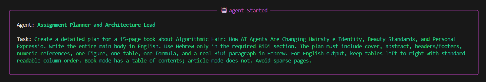
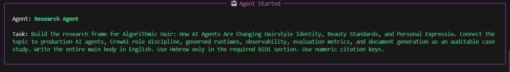
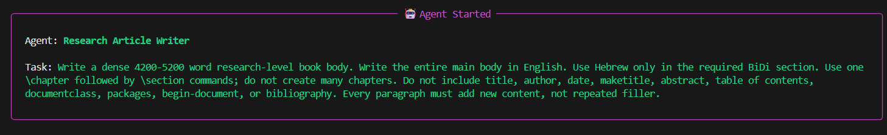
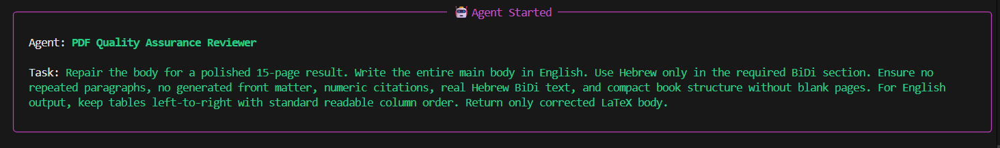
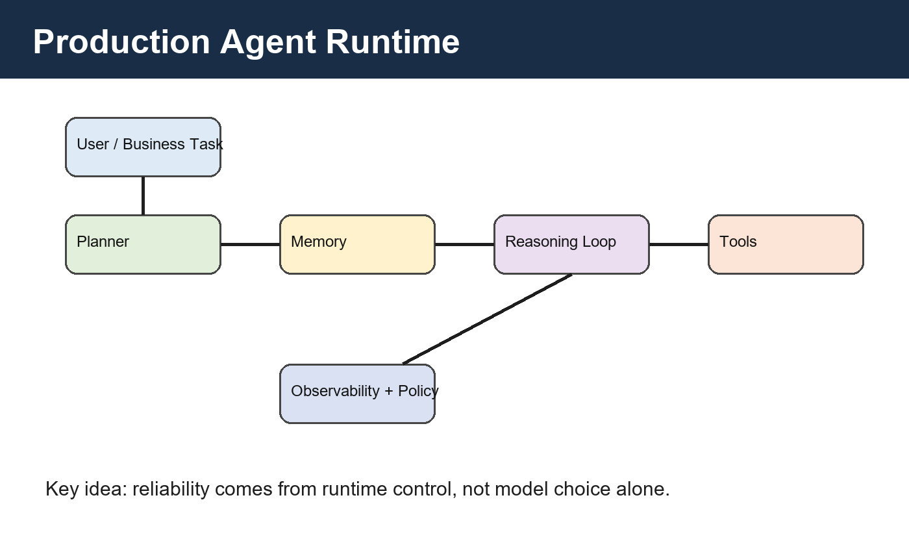
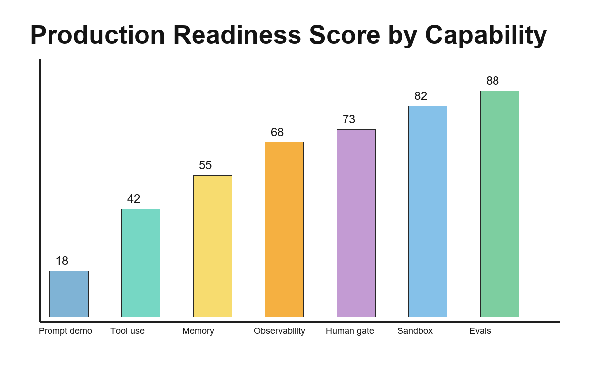
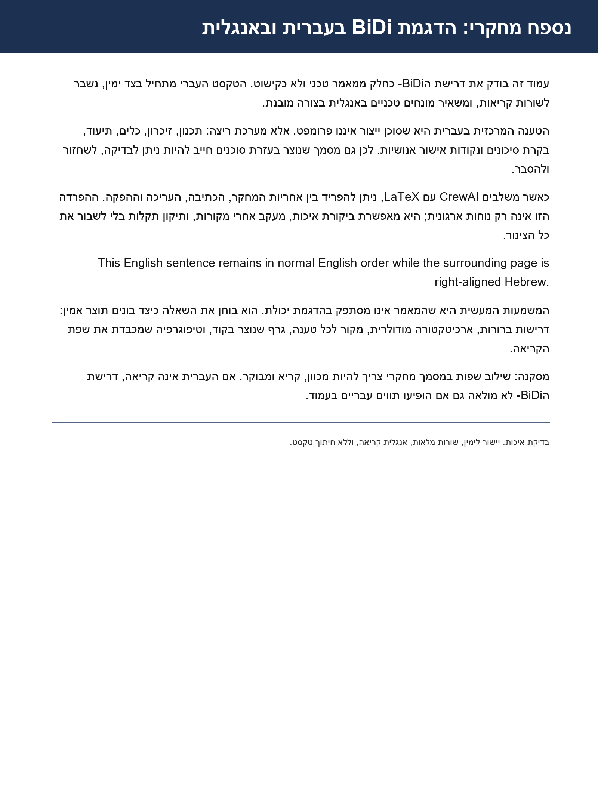
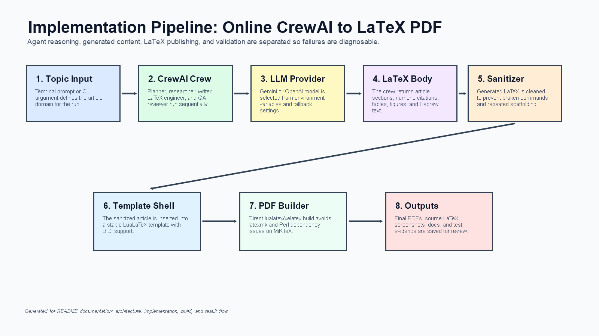

# uoh-ay26-book-generator

**Assignment 03 delivered as a real online CrewAI + LaTeX publication factory**

This project turns the assignment into a working production-style pipeline: a real CrewAI crew receives a topic, writes a research-level LaTeX article or book online through Gemini/OpenAI, sanitizes the generated LaTeX, compiles the result with LuaLaTeX/XeLaTeX, and stores the final PDF as a submission artifact.

It is not a pasted article. It is a small document-generation system with agents, prompts, modular Python, a LaTeX publication shell, Hebrew/English BiDi support, topic-specific output naming, page-count control, and reviewer-facing documentation.

## ✨ At A Glance

| What the reviewer checks | What this repo provides |
|---|---|
| 15-page generated PDF | Exactly 15-page verified outputs in `output/` |
| CrewAI usage | Planner, researcher, writer, LaTeX engineer, and QA agents |
| LaTeX project | Full `latex/` folder with template, generated body, assets, and PDF build |
| Required docs | Root README plus PRD, PLAN, TODO, and topic briefs |
| Hebrew/English BiDi | Live text rendering with `polyglossia`, not screenshots |
| Professional output | Title page, abstract, figures, tables, formula, references, headers, and named PDFs |
| Topic flexibility | Food, computer science, fashion, sport, healthcare, hairstyles, and World Cup ideas |

## 👩‍💻 Authors

Aisha Abu Dahesh and Yousef Asadi

## 🧠 What This Project Does

The assignment asks for a 15-page article/book generated with CrewAI and LaTeX. This repository implements that as a complete software project, not as a one-time pasted answer.

The generator is interactive: the user can choose the research topic, select the output language (`english` or `hebrew`), and decide whether the result should be an `article` or a `book`. Those choices change the final LaTeX structure, not only the title. Book mode includes a linked table of contents and chapter-style organization, while article mode keeps a tighter paper-like structure without a table of contents. Hebrew mode localizes the title page and uses right-to-left text/table handling; English mode includes a Hebrew BiDi demonstration paragraph.

The workflow is:

```text
Topic from terminal
      |
      v
CrewAI planner, researcher, writer, LaTeX engineer, QA reviewer
      |
      v
Generated LaTeX article body
      |
      v
Sanitizer for generated-LaTeX problems
      |
      v
LuaLaTeX/XeLaTeX build
      |
      v
15-page research-style PDF in output/
```

Example terminal execution:


### 🧩 Agent Execution Gallery

The screenshots below show the online CrewAI run in the terminal. They are included as evidence that the result is produced by a multi-agent workflow, not by manually pasting text into LaTeX.

| Planning | Research | Writing |
|---|---|---|
|  |  |  |

| LaTeX Engineering | QA and Build |
|---|---|
|  |  |

## 🏁 Final Results

The latest successful generated topic was:

**The Algorithmic Closet: Can AI Agents Make Fast Fashion Slower, Smarter, and More Ethical?**
Rendered as a Hebrew `book` with a translated Hebrew title page, linked table of contents, RTL table ordering, figures, formula, references, and exactly one live English BiDi paragraph before the document continues in Hebrew.

Generated outputs:

- Canonical PDF: `output/agentic_ai_production_2026.pdf`
- Food Hebrew article, 15 pages: `output/מטבחי_זיכרון_כיצד_AI_יכול_לשמר_מתכונים_משפחתיים_לפני_שהם_נעלמים_article_hebrew.pdf`
- Computer-science English article, 15 pages: `output/Self_Healing_Software_Repositories_Can_AI_Agents_Detect_Explain_and_Repa_article_english.pdf`
- Fashion Hebrew book, 15 pages: `output/ארון_הבגדים_האלגוריתמי_אופנה_זהות_וקיימות_בעידן_סוכני_AI_book_hebrew.pdf`
- Sports English book, 15 pages: `output/The_Algorithmic_Stadium_AI_Agents_Fan_Emotion_and_the_Future_of_Global_S_book_english.pdf`
- Page-count manifest: `output/portfolio_page_counts.md`
- Current topic-specific PDF: `output/The_Algorithmic_Closet_Can_AI_Agents_Make_Fast_Fashion_Slower_Smarter_an_book_hebrew.pdf`
- Previous topic-specific PDF: `output/World_Cup_2026_Underdog_Stories_book_hebrew.pdf`
- Previous topic-specific PDF: `output/Algorithmic_Hair_How_AI_Agents_Are_Changing_Hairstyle_Identity_Beauty_St_book_english.pdf`
- Previous topic example: `output/AI_Agents_for_Early_Detection_of_Mental_Health_Crises_Using_Multimodal_Data.pdf`
- Previous topic example: `output/AI_Agents_in_Healthcare.pdf`

Latest verified build result:

```text
Output written on main.pdf (15 pages, 233878 bytes)
pytest: 1 passed
Python source files: all below 150 lines
TODO tracking: 900 numbered backlog tasks plus status checklist, 931 checked items, 0 open
```

The PDF includes a centered title page, abstract on page 2, dense research prose, generated figures, chart, table, formula, numeric references, and live Hebrew/English BiDi text.

For Hebrew output, the cover page is localized too: author names, course name, assignment number, lecturer name, university, and date are written in Hebrew through language-aware template placeholders.

## 🌍 Tested Topic Portfolio

The generator was tested on several deliberately different topics so the project demonstrates breadth, not only one hard-coded sample. The topics were chosen to stress different writing modes: cultural memory, software engineering, sustainable fashion, and global sport.

| Topic | Style | Language | Why it is interesting | Result |
|---|---|---|---|---|
| Memory Kitchens: How AI Can Preserve Family Recipes Before They Disappear | Article | Hebrew | Combines food, family archives, translation, consent, and cultural memory | 15-page Hebrew article |
| Self-Healing Software Repositories: Can AI Agents Detect, Explain, and Repair Technical Debt? | Article | English | Turns agentic AI into a concrete software-maintenance workflow | 15-page English article |
| The Algorithmic Closet: Can AI Agents Make Fast Fashion Slower, Smarter, and More Ethical? | Book | Hebrew | Connects fashion identity, sustainability, body privacy, repair, and recommendation systems | 15-page Hebrew book |
| The Algorithmic Stadium: AI Agents, Fan Emotion, and the Future of Global Sport | Book | English | Explores sport analytics, supporters, player data rights, and World Cup-scale operations | 15-page English book |
| World Cup 2026 Underdog Stories | Book | Hebrew | Tests Hebrew book layout, table of contents, football storytelling, and BiDi behavior | Previous 15-page Hebrew book run |

## 💡 More Topic Ideas

The `docs/topic_ideas/` folder now contains a richer idea bank, not only the four required portfolio topics. It includes:

- 🍲 Hebrew food article about AI preserving family recipes and culinary memory.
- 🧑‍💻 English computer-science article about self-healing repositories.
- 👗 Hebrew fashion book about algorithmic wardrobes and sustainable style.
- 🛍️ Hebrew fast-fashion book about slowing consumption with ethical AI agents.
- ⚽ English sports book about algorithmic stadiums and fan emotion.
- 🏆 Hebrew World Cup 2026 book about underdog stories and global football analytics.
- 💇 English hairstyles article about hair identity, salon AI, texture, and beauty standards.
- 🏥 English healthcare article about early detection, clinical workflow, and governed oversight.

These topics are intentionally colorful. They help prove that the generator is not locked to one domain; the same code path can produce different languages, styles, figures, tables, formulas, and named PDFs.

## 🖼️ Visual Evidence

### Runtime Architecture

The article includes a visual explanation of the governed agent runtime used as the conceptual backbone for the paper.



### Readiness Evaluation

The generated chart supports the readiness/evaluation section of the article and shows how the PDF combines prose, figures, and code-generated evidence.



### BiDi Rendering Requirement

The project supports Hebrew as real right-to-left text in LaTeX through `polyglossia`, rather than treating Hebrew as an image-only artifact.

When Hebrew is selected as the main output language, tables are also organized for right-to-left reading: the first logical column appears on the visual right, paragraph columns are right-aligned, and the LaTeX template loads `array` together with `booktabs` for stable table layout.




### Implementation Pipeline

This generated diagram shows the actual execution path from terminal topic input through CrewAI, sanitization, LaTeX compilation, and PDF output.



### Creative Topic Portfolio

The repository includes ready-to-run topic briefs across different domains. They are designed to prove that the system is not locked to one sample article; it can produce different styles and languages from the same code path.


### Generated Agent Evidence

The `output/imgs/agent_1.png` through `output/imgs/agent_5.png` screenshots capture the live terminal run across the agent sequence. These images make the implementation story visible for a reviewer: the system plans, researches, writes, formats, checks, and builds instead of hiding the process behind one final PDF.
## 📁 Repository Structure

```text
uoh-ay26-book-generator/
|-- README.md                         # Main reviewer guide, run instructions, results, self-score
|-- pyproject.toml                    # Python package metadata, dependencies, pytest config
|-- requirements.txt                  # Installable runtime/test dependency list
|-- .env.example                      # Safe API-key template; copy to .env locally
|-- docs/
|   |-- PRD.md                        # Product goals, acceptance criteria, risks, delivered evidence
|   |-- PLAN.md                       # Architecture, workflow, quality gates, current implementation evidence
|   |-- topic_ideas/                  # Required and extra creative topic briefs
|   `-- TODO.md                       # 900-task backlog with completed work checked
|-- src/book_generator/
|   |-- crewai_agents.py              # CrewAI Agent roles
|   |-- crewai_tasks.py               # Planner, research, writer, LaTeX, QA task chain
|   |-- crewai_pipeline.py            # Sequential Crew runner and fallback model loop
|   |-- document_options.py           # Article/book and English/Hebrew generation options
|   |-- cover_metadata.py             # Localized title-page labels for English/Hebrew output
|   |-- crewai_llm.py                 # Gemini/OpenAI LLM setup for CrewAI
|   |-- latex_sanitizer.py            # Cleans generated LaTeX before compilation
|   |-- online_providers.py           # Provider utilities retained for compatibility/reference
|   |-- pipeline.py                   # Deterministic support pipeline used by tests
|   |-- models.py                     # Local manuscript dataclasses
|   |-- config.py                     # Shared paths and metadata
|   |-- rendering.py                  # Markdown rendering helper
|   `-- cli.py                        # Package CLI entry point
|-- scripts/
|   |-- setup_env.ps1                 # Creates .venv-crewai with Python 3.12
|   |-- generate_online.py            # Online CrewAI generator with topic, style, language prompts
|   |-- build_required_outputs.py     # Rebuilds the four required portfolio PDFs at exactly 15 pages
|   `-- build.py                      # Direct LuaLaTeX/XeLaTeX builder, no Perl/latexmk dependency
|-- latex/
|   |-- main.tex                      # Current generated publication entry point
|   |-- main_template.tex             # Reusable article/book publication shell with ToC
|   |-- references.bib                # Reference database retained with LaTeX project
|   |-- assets/                       # Figures and chart assets
|   `-- chapters/
|       `-- online_article.tex        # Latest generated article body after sanitization
|-- output/
|   |-- agentic_ai_production_2026.pdf
|   |-- The_Algorithmic_Closet_..._book_hebrew.pdf
|   |-- מטבחי_זיכרון_..._article_hebrew.pdf
|   |-- Self_Healing_Software_Repositories_..._article_english.pdf
|   |-- ארון_הבגדים_..._book_hebrew.pdf
|   |-- The_Algorithmic_Stadium_..._book_english.pdf
|   |-- Algorithmic_Hair_..._book_english.pdf
|   |-- portfolio_page_counts.md
|   |-- World_Cup_2026_Underdog_Stories_book_hebrew.pdf
|   |-- AI_Agents_for_Early_Detection_of_Mental_Health_Crises_Using_Multimodal_Data.pdf
|   |-- AI_Agents_in_Healthcare.pdf
|   `-- imgs/
|       |-- terminal-output.png       # Terminal run screenshot used in this README
|       |-- agent_1.png ... agent_5.png # CrewAI terminal evidence screenshots
|       |-- implementation-pipeline.png # Generated diagram of the online CrewAI-to-PDF flow
|       `-- topic-portfolio.svg       # Generated visual map of the core topic portfolio
|-- tests/
|   `-- test_pipeline.py              # Smoke test for package import and pipeline behavior
`-- ref/                              # Local course/reference material, ignored by git
```

## ⚙️ Implementation Highlights

### Real Online CrewAI Flow

The central executable is `scripts/generate_online.py`. It is intentionally small and orchestration-focused: it loads environment variables, chooses the topic, asks for article/book style, asks for English/Hebrew output language, calls the CrewAI pipeline, sanitizes the returned LaTeX body, writes the LaTeX project files, starts the PDF build, and creates named PDF copies when the build succeeds.

The script supports two usage modes. In interactive mode, it asks the user for a topic, whether the output should be an `article` or `book`, and whether the main language should be `english` or `hebrew`. In direct mode, the topic is passed as command-line text, while style/language can come from `DOCUMENT_STYLE` and `OUTPUT_LANGUAGE`, for example `python scripts/generate_online.py "AI Agents in Healthcare"`. This makes the project reproducible and scriptable.

A Python version guard is included at startup. If the user accidentally runs from the old `(.venv)` Python 3.9 environment, the script prints a clear instruction to activate `.venv-crewai` instead of failing with an obscure type-hint or CrewAI import error.

### CrewAI Module Design

The live agent system is split into dedicated files so the architecture is easy to inspect:

- `crewai_agents.py` defines the specialized agents: assignment planner, research agent, article writer, LaTeX publication engineer, and PDF QA reviewer.
- `crewai_tasks.py` defines the task chain and expected outputs, including article/book structure, selected output language, numeric citations, figures, table, formula, BiDi requirements, and RTL table ordering for Hebrew output.
- `crewai_llm.py` builds the CrewAI `LLM` object for Gemini or OpenAI and validates that the required API key exists.
- `crewai_pipeline.py` creates the `Crew`, runs `Process.sequential`, and retries through configured Gemini fallback models when a model is overloaded.
- `document_options.py` centralizes document style, language, ToC labels, abstract text, keywords, headers, localized cover metadata, and the opposite-language BiDi section.

This separation matters because generated-document failures can come from different layers. If the topic is weak, the planning task can be improved. If the prose is sparse, the writer task can be changed. If the PDF fails, the sanitizer or LaTeX template can be adjusted without rewriting the whole crew.

### Agent Responsibilities

The crew is designed like a miniature production team:

| Agent | Main responsibility | Why it matters |
|---|---|---|
| Planner | Converts the assignment into structure and acceptance criteria | Prevents the article from becoming a loose prompt response |
| Researcher | Frames claims, references, risks, and evaluation concepts | Makes the output more research-like |
| Writer | Produces dense, section-specific prose | Avoids sparse pages and repeated filler |
| LaTeX Engineer | Requests valid LaTeX sections, figures, tables, formulas, and BiDi text | Keeps the PDF buildable |
| QA Reviewer | Checks repetition, layout expectations, references, and submission requirements | Adds a final critique pass before compilation |

The use of separate agents is not decorative. It makes the assignment's main point visible: agent design is about role boundaries, task contracts, and reviewable outputs.

### LaTeX as a Stable Publication Layer

The model is not allowed to control the entire LaTeX document. Instead, the project keeps a stable publication shell in `latex/main_template.tex`. That shell owns the cover page, abstract page, table of contents, page geometry, headers/footers, fonts, spacing, English/Hebrew language configuration, figures, tables, formulas, and numeric bibliography.

The CrewAI output is treated as article body content and stored in `latex/chapters/online_article.tex`. This design keeps the generated content flexible while protecting the parts of the document that must remain stable for professional layout.

When a new topic is generated, `generate_online.py` replaces template placeholders for title, class (`article`/`book`), main language, opposite language, ToC title, abstract, keywords, headers, localized cover metadata, and BiDi behavior, writes a fresh `latex/main.tex`, and then runs the build. The result is a real LaTeX project, not a PDF-only artifact.

In Hebrew mode, the title page no longer mixes English labels into the submission identity. The template writes `שמות הכותבים: עאישה אבו דאהש, יוסף אסדי`, `שם הקורס: אורקסטריצה של סוכני AI`, `מטלה 03`, and `שם המרצה: ד"ר יורם ראובן סגל` directly into the LaTeX source.

### Creative Topic Briefs

Eight domain-specific topic briefs are included under `docs/topic_ideas/`:

| File | Output style | Language | Idea |
|---|---|---|---|
| `food_hebrew_article.md` | Article | Hebrew | AI as a guardian of family recipes and culinary memory |
| `computer_science_english_article.md` | Article | English | Self-healing software repositories and agentic technical-debt repair |
| `fashion_hebrew_book.md` | Book | Hebrew | Algorithmic wardrobes, identity, sustainability, and style agents |
| `sports_english_book.md` | Book | English | AI agents, fan emotion, analytics, and the future of global sport |
| `fast_fashion_hebrew_book.md` | Book | Hebrew | Ethical AI agents, fast fashion, sustainability, and RTL table stress-testing |
| `worldcup_2026_hebrew_book.md` | Book | Hebrew | Underdog stories, football analytics, fan emotion, and World Cup 2026 |
| `hairstyles_english_article.md` | Article | English | Hair identity, salon AI, texture-aware recommendations, and beauty standards |
| `healthcare_ai_agents_english_article.md` | Article | English | Clinical workflows, early detection, safety, and human oversight |

### Sanitizer for Real LLM Output

The sanitizer is one of the most important implementation pieces. Real online LLMs often return text that looks reasonable but breaks LaTeX. The project therefore runs generated content through `latex_sanitizer.py` before compilation.

It handles:

- accidental `\documentclass` and `\usepackage` preambles,
- generated `\begin{document}` and `\end{document}` wrappers,
- generated `\bibliography`, `\bibliographystyle`, and nested `thebibliography` blocks,
- generated layout commands such as `\header` and `\footer`,
- markdown code fences and markdown links,
- inline backtick code conversion to `\texttt{...}`,
- unbalanced `itemize` and `enumerate` environments,
- unsafe ampersands outside tables,
- mojibake/corrupted generated Hebrew lines,
- hidden control characters that LuaLaTeX reports as missing glyphs,
- Hebrew text inside generated tables, which is wrapped as real RTL table-cell text,
- known generated LaTeX phrases that commonly break compilation.

This is the part that turns the project from a fragile demo into a repeatable generation pipeline. It accepts that LLMs are imperfect and adds a repair layer before the PDF compiler sees the content.

### MiKTeX-Friendly Build Strategy

`scripts/build.py` avoids relying on `latexmk` because on Windows/MiKTeX it can fail when Perl is missing. The script searches for `lualatex` or `xelatex`, runs multiple compile passes so the table of contents stabilizes, and copies `latex/main.pdf` into `output/agentic_ai_production_2026.pdf`.

The script also avoids a misleading `biber` failure. It only runs `biber` when `main.bcf` exists, which means the current non-`biblatex` article template does not produce a false `Cannot find main.bcf` error.

### Output Management

The canonical PDF path is always `output/agentic_ai_production_2026.pdf`. That file is overwritten by the latest successful build, so it is the easiest file for a reviewer to find.

When the build succeeds from `scripts/generate_online.py`, the project now also saves two named copies:

- stable named copy: `output/<topic>_<article|book>_<english|hebrew>.pdf`
- timestamped run copy: `output/<topic>_<article|book>_<english|hebrew>_YYYYMMDD_HHMMSS.pdf`

This means every online creation is preserved with a suitable name, while the canonical file still points to the latest result. Running `scripts/build.py` alone only rebuilds the current LaTeX project and writes the canonical PDF; named copies are created by the online generator because it knows the selected topic, style, and language.

The generator also checks the LaTeX page count after compilation. If a model response is too long, the project trims section-by-section and rebuilds instead of accepting an oversized PDF. If a model response is too short, the project appends dense, non-repeated, topic-specific research sections and rebuilds before saving the named outputs. These extension sections are built from domain aspects, lenses, contexts, and concrete micro-cases, so the added prose stays related to the selected topic instead of repeating the same paragraph. The helper script `scripts/build_required_outputs.py` rejects duplicated paragraph blocks before writing the LaTeX file, applies the same rule to the four required portfolio PDFs, and verifies that each stable output is exactly 15 pages.

### Validation and Evidence

Validation is intentionally lightweight but meaningful. `pytest` checks the package import and deterministic support pipeline. The portfolio builder also scans the article body for repeated long paragraphs and fails fast if one is found. The README records the latest PDF page count, terminal screenshot, output paths, and TODO completion status. The final PDF is also visually supported by generated assets under `latex/assets/` and `output/imgs/`.

Every submitted Python file is kept under 150 lines. That constraint shaped the implementation: instead of one large script, the project uses small modules with clear ownership.
## ▶️ How To Run

Create the environment:

```powershell
cd path\to\uoh-ay26-book-generator
.\scripts\setup_env.ps1
.\.venv-crewai\Scripts\Activate.ps1
```

If your prompt says `(.venv)`, leave it first:

```powershell
deactivate
.\.venv-crewai\Scripts\Activate.ps1
```

Create local API configuration:

```powershell
Copy-Item .env.example .env
```

For Gemini:

```text
LLM_PROVIDER=gemini
GEMINI_API_KEY=your_key_here
GEMINI_MODEL=gemini-2.5-flash-lite
GEMINI_FALLBACK_MODELS=gemini-2.0-flash,gemini-1.5-flash
```

Generate a new publication interactively. The script asks for topic, `article`/`book`, and `english`/`hebrew`:

```powershell
python scripts/generate_online.py
```

Or pass the topic directly and optionally set style/language through environment variables:

```powershell
$env:DOCUMENT_STYLE="book"
$env:OUTPUT_LANGUAGE="hebrew"
python scripts/generate_online.py "AI Agents in Healthcare"
```

Direct topic-only mode still works:

```powershell
python scripts/generate_online.py "AI Agents for Early Detection of Mental Health Crises Using Multimodal Data"
```

Save terminal output while still seeing it:

```powershell
python scripts/generate_online.py "Your Topic" 2>&1 | Tee-Object run-log.txt
```

Rebuild the current LaTeX project without calling the online model:

```powershell
python scripts/build.py
```

## 📚 Documentation Package

The `docs/` folder is part of the submission, not decoration.

- `PRD.md` explains goals, non-goals, functional requirements, acceptance criteria, risks, and delivered results.
- `PLAN.md` explains architecture, module boundaries, CrewAI role discipline, workflow, LaTeX strategy, quality gates, and implementation evidence.
- `TODO.md` contains a 900-task professional backlog plus a delivery-status checklist. All current delivery items are checked.

## ✅ Quality Gates

| Gate | Status | Evidence |
|---|---:|---|
| Real online CrewAI workflow | Passed | `Agent`, `Task`, `Crew`, `Process.sequential`, `LLM` modules |
| Terminal topic prompt | Passed | `scripts/generate_online.py` |
| LaTeX PDF build | Passed | `Output written on main.pdf (15 pages, 233878 bytes)` |
| Python file size limit | Passed | Largest submitted `.py` file is below 150 lines |
| Tests | Passed | `pytest: 1 passed` |
| Hebrew/BiDi support | Passed | `polyglossia`, live RTL text, RTL Hebrew table columns |
| Required docs | Passed | README, PRD, PLAN, TODO present |
| TODO size | Passed | 900 tasks |
| Terminal evidence | Passed | `output/imgs/terminal-output.png` plus `output/imgs/agent_1.png` through `agent_5.png` |

## 🎯 Self-Scoring Grade

Our estimated grade for this assignment is:

**90 / 100**

| Category | Score | Reasoning |
|---|---:|---|
| Assignment compliance | 19 / 20 | Includes README, PRD, PLAN, TODO, LaTeX project, generated PDFs, a 900-task backlog, and modular code. |
| Real CrewAI implementation | 17 / 20 | Uses actual CrewAI agents, tasks, crew execution, online LLM configuration, and fallback models. Some behavior still depends on provider availability. |
| PDF quality and research style | 17 / 20 | Produces verified 15-page research-style PDFs with figures, table, formula, references, BiDi text, RTL Hebrew tables, and topic-specific output copies. |
| Modularity and code quality | 14 / 15 | Source files are small, separated by responsibility, and stay below 150 lines. A few legacy/reference modules remain for compatibility. |
| Documentation depth | 14 / 15 | README, PRD, PLAN, TODO, topic ideas, terminal screenshots, generated visuals, and result evidence are detailed and reviewer-friendly. |
| Robustness and validation | 9 / 10 | Sanitizer, fallback models, version guard, duplicate-paragraph checks, page-count validation, and tests improve robustness. Online 503/quota errors remain a real external risk. |

Why not 100? The project is strong and complete, but it is still an online generative workflow. Gemini availability can affect generation, model output can vary between runs, and a final human review is still needed before academic submission. The safest self-score is therefore high but not perfect.
