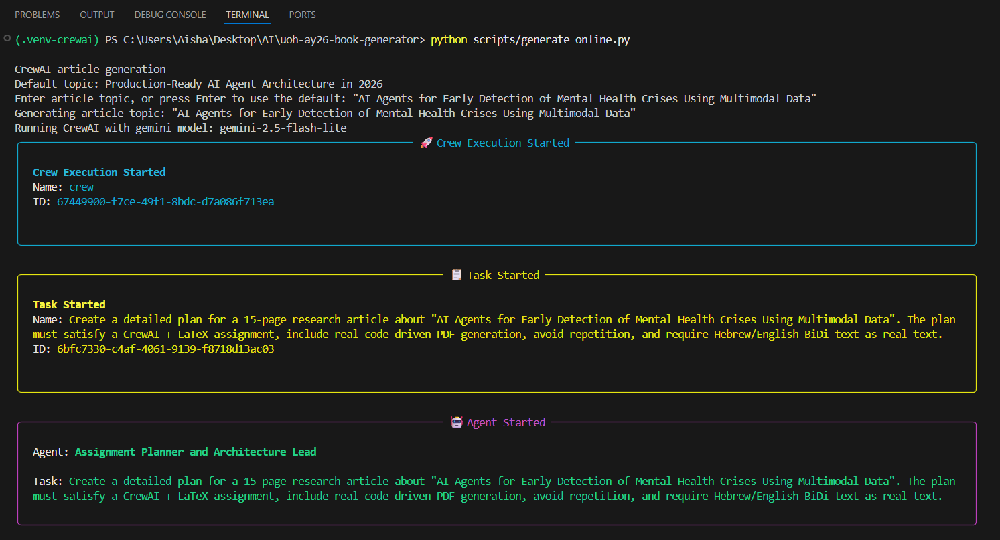

# uoh-ay26-book-generator

Professional online CrewAI + LaTeX article generator for Assignment 03.

## Authors

Aisha Abu Dahesh and Yousef Asadi

## Assignment Context

This repository implements Assignment 03: generate an approximately 15-page article/book using CrewAI agents, then produce the final PDF through a LaTeX project. The main grading artifact is the PDF, but the repository also documents the product requirements, plan, backlog, code structure, environment setup, and reproducible build process.

The project is online by design. `scripts/generate_online.py` starts a real CrewAI crew with separate planning, research, writing, LaTeX engineering, and QA responsibilities. The crew calls Gemini or OpenAI through CrewAI `LLM`, writes LaTeX section content, sanitizes common generated-LaTeX problems, and compiles the PDF with LuaLaTeX/XeLaTeX.

## Final PDF

The canonical generated PDF is:

`output/agentic_ai_production_2026.pdf`

Topic-specific copies may also appear in `output/`, for example `output/AI_Agents_for_Early_Detection_of_Mental_Health_Crises_Using_Multimodal_Data.pdf`, when a custom article topic is generated.

The delivered article is a research-style technical paper with a centered title page, abstract on page 2, continuous article body, professional headers and footers, figures, a graph, a table, a formula, real Hebrew/English BiDi text, and numeric references. The assignment target is approximately 15 pages; the latest custom-topic mental-health-crisis build is 15 pages.

## Repository Structure

```text
uoh-ay26-book-generator/
|-- README.md                         # Main reviewer guide, run instructions, output summary
|-- pyproject.toml                    # Python package metadata, pytest config, src layout
|-- requirements.txt                  # Runtime dependencies for CrewAI, Gemini/OpenAI, dotenv, tests
|-- .env.example                      # Safe API-key template; copy to .env locally
|-- docs/
|   |-- PRD.md                        # Product goals, functional requirements, acceptance criteria
|   |-- PLAN.md                       # Architecture, workflow, quality gates, LaTeX strategy
|   `-- TODO.md                       # 900-task professional implementation backlog
|-- src/book_generator/
|   |-- crewai_agents.py              # Real CrewAI Agent definitions
|   |-- crewai_tasks.py               # CrewAI Task chain for planning, research, writing, LaTeX, QA
|   |-- crewai_pipeline.py            # Sequential Crew runner with provider fallback handling
|   |-- crewai_llm.py                 # Gemini/OpenAI LLM configuration for CrewAI
|   |-- latex_sanitizer.py            # Generated-LaTeX cleanup before compilation
|   |-- pipeline.py                   # Deterministic support pipeline used by tests/reference flow
|   |-- models.py                     # Lightweight dataclasses for local manuscript modeling
|   |-- config.py                     # Shared project paths and metadata
|   |-- rendering.py                  # Markdown rendering helper
|   `-- cli.py                        # Local package CLI entry point
|-- scripts/
|   |-- setup_env.ps1                 # Creates .venv-crewai with Python 3.12 dependencies
|   |-- generate_online.py            # Main online CrewAI generation command with topic prompt
|   `-- build.py                      # Direct LuaLaTeX/XeLaTeX PDF builder, no Perl/latexmk dependency
|-- latex/
|   |-- main.tex                      # Current generated publication entry point
|   |-- main_template.tex             # Reusable LaTeX shell used by generate_online.py
|   |-- references.bib                # Reference database retained with the LaTeX project
|   |-- assets/                       # Generated diagrams/figures used by the paper
|   `-- chapters/
|       `-- online_article.tex        # Latest CrewAI-generated article body after sanitization
|-- output/
|   |-- agentic_ai_production_2026.pdf
|   |-- AI_Agents_for_Early_Detection_of_Mental_Health_Crises_Using_Multimodal_Data.pdf
|   |-- AI_Agents_in_Healthcare.pdf
|   `-- imgs/
|       `-- terminal-output.png       # Example terminal run screenshot for documentation
|-- tests/
|   `-- test_pipeline.py              # Smoke test for the modular support pipeline
`-- ref/                              # Local course/reference material, ignored by git
```

## Implementation Details

The implemented workflow is code-driven and online. `scripts/generate_online.py` loads `.env`, asks for a topic when one is not supplied, constructs a real CrewAI crew, runs the sequential agent workflow, writes the generated article body into the LaTeX project, sanitizes generated LaTeX, compiles the document, and copies the finished PDF into `output/`.

The CrewAI implementation is split by responsibility. `crewai_agents.py` defines the roles, `crewai_tasks.py` defines the task sequence, `crewai_llm.py` configures Gemini/OpenAI models, and `crewai_pipeline.py` executes the crew with fallback model handling. This keeps the architecture modular and keeps every Python file below the 150-line assignment limit.

The LaTeX layer is also separated from the generator. `latex/main_template.tex` owns document style, title page, abstract page, headers, spacing, Hebrew support, figures, and numeric references. The online agent writes only the article body into `latex/chapters/online_article.tex`, which prevents generated content from replacing the publication shell.

`latex_sanitizer.py` handles common LLM output problems before build: accidental `\documentclass` or `\usepackage` preambles, generated `\begin{document}` wrappers, nested bibliographies, markdown code fences, markdown links, unbalanced lists, unsafe ampersands, and corrupted mojibake blocks. This was necessary because online models sometimes return a full LaTeX document even when the expected output is only a body section.

The build path intentionally avoids `latexmk` because MiKTeX can have `latexmk` installed without Perl. `scripts/build.py` directly finds and runs `lualatex` or `xelatex`, performs multiple passes, and only invokes `biber` when a `.bcf` file exists.

## Results

The latest successful generated topic was:

**AI Agents for Early Detection of Mental Health Crises Using Multimodal Data**

The latest build produced a 15-page PDF with a centered title page, abstract on page 2, dense article body, figures, table, formula, numeric references, and live Hebrew/English BiDi text. The canonical output is `output/agentic_ai_production_2026.pdf`, and the topic-specific copy is `output/AI_Agents_for_Early_Detection_of_Mental_Health_Crises_Using_Multimodal_Data.pdf`.

Example terminal run:



## CrewAI Architecture

The online workflow uses actual CrewAI primitives, not only a static imitation:

- `Agent` objects define role, goal, backstory, and constraints.
- `Task` objects define expected outputs for each role.
- `Crew` coordinates the work through `Process.sequential`.
- `LLM` connects the crew to Gemini or OpenAI.
- A LaTeX sanitizer protects the build from typical LLM output mistakes, including generated preambles, nested bibliographies, markdown formatting, and malformed list blocks.
- `scripts/build.py` compiles the final PDF with direct `lualatex` or `xelatex`.

The CrewAI roles are:

- Planner Agent: converts the assignment into acceptance criteria and structure.
- Research Agent: frames the scholarly claims and reference needs.
- Writer Agent: produces coherent research-article prose.
- LaTeX Engineer Agent: requests valid LaTeX sections, figures, tables, formulas, references, and BiDi text.
- QA Agent: checks that the article is useful as a PDF submission, not just fluent text.

## Python Modules

The package under `src/book_generator/` is split into small files so every submitted `.py` file remains below 150 lines.

- `config.py` - project metadata and paths.
- `models.py` - dataclasses for local document models.
- `agents.py` - legacy/static role definitions retained for tests and reference.
- `pipeline.py` - deterministic support pipeline retained for local checks.
- `rendering.py` - Markdown rendering helper.
- `cli.py` - command-line entry point.
- `crewai_llm.py` - Gemini/OpenAI CrewAI LLM configuration.
- `crewai_agents.py` - real CrewAI agent definitions.
- `crewai_tasks.py` - real CrewAI task definitions.
- `crewai_pipeline.py` - live Crew execution with fallback model handling.
- `latex_sanitizer.py` - cleanup for generated LaTeX before compilation.

## Environment Setup

CrewAI requires a modern Python version. Use Python 3.12 and the provided setup script. If your terminal prompt shows `(.venv)`, run `deactivate` first; the online CrewAI workflow should run from `(.venv-crewai)`:

```powershell
.\scripts\setup_env.ps1
.\.venv-crewai\Scripts\Activate.ps1
```

The setup installs:

- `crewai[google-genai]` for the online CrewAI workflow.
- `openai` for the optional OpenAI provider.
- `python-dotenv` for `.env` loading.
- `pytest` for validation.

Create your local environment file:

```powershell
Copy-Item .env.example .env
```

For Gemini, set:

```text
LLM_PROVIDER=gemini
GEMINI_API_KEY=your_key_here
GEMINI_MODEL=gemini-2.5-flash-lite
GEMINI_FALLBACK_MODELS=gemini-2.0-flash,gemini-1.5-flash
```

For OpenAI, set:

```text
LLM_PROVIDER=openai
OPENAI_API_KEY=your_key_here
OPENAI_MODEL=gpt-5.2
```

API keys belong only in `.env`; do not commit them.

## Online Generation

Run the assignment workflow from the activated environment:

```powershell
python scripts/generate_online.py
```

The script asks for the article topic in the terminal:

```text
CrewAI article generation
Default topic: Production-Ready AI Agent Architecture in 2026
Enter article topic, or press Enter to use the default:
```

You can also pass the topic directly:

```powershell
python scripts/generate_online.py "AI Agents for Clinical Decision Support"
```

The script then:

1. Loads `.env`.
2. Builds the real CrewAI crew.
3. Sends the topic to the online model provider.
4. Writes the generated article body to `latex/chapters/online_article.tex`.
5. Rewrites `latex/main.tex` from `latex/main_template.tex`.
6. Compiles the PDF through `scripts/build.py`.
7. Writes `output/agentic_ai_production_2026.pdf`.

If Gemini returns a temporary 500/503 high-demand server error or a quota error, the runner tries the configured fallback models. The default starts with `gemini-2.5-flash-lite` because it is usually less overloaded than `gemini-2.5-flash`. This is expected behavior for online LLM workflows.

## Local LaTeX Build

To rebuild the PDF from existing LaTeX sources without asking the agents to write new text:

```powershell
python scripts/build.py
```

The build script avoids the MiKTeX `latexmk`/Perl problem by preferring direct `lualatex` or `xelatex`. LuaLaTeX is recommended because the article contains Unicode and Hebrew text.

## Documentation

The required Markdown documentation is in `docs/`:

- `PRD.md` explains product goals, users, requirements, acceptance criteria, and risks.
- `PLAN.md` explains architecture, workflow, CrewAI design, LaTeX strategy, and quality gates.
- `TODO.md` contains a 900-task professional backlog.

## Quality Notes

The latest project revisions address the requested grading concerns:

- The workflow is real online CrewAI generation, not manual offline writing.
- The PDF uses a continuous article layout with no forced empty book pages.
- The title page is centered and the abstract starts on the next page.
- The body is page-dense without repeating filler paragraphs; exact page count can vary by generated topic length.
- Hebrew is rendered as live right-to-left text, not as a screenshot.
- References are numeric and ordered like a paper bibliography.
- Every submitted `.py` file is below 150 lines.
